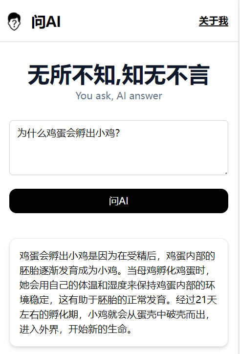

# [ask.ailife.ltd](https://ask.ailife.ltd/)

超简洁的AI问答网站

[](https://ask.ailife.ltd)

## 工作原理

用户输入问题提交后，调用[openai接口](https://platform.openai.com/docs/api-reference/chat)获取答案，将答案流式输出到页面。

## 本地运行，本地访问

1. 创建openai账号，进入[openAI页面](https://platform.openai.com/account/api-keys)查看api key.
2. 将项目根目录中的.env.example复制一份放在项目根目录，并将名字改为.env，将上一步查到的api key填到.env中
```text
GROQ_API_KEY=上一步看到的api key
```
3. 打开控制台，进入项目根目录，输入`npm install`安装依赖。
4. 输入`npm run dev`运行。
5. 在浏览器输入`http://localhost:3000`即可访问。

## 一键免费部署到vercel,公网访问

[](https://vercel.com/new/clone?repository-url=https://github.com/wsliliang/ask-ai&env=GROQ_API_KEY&project-name=ask-ai&repo-name=ask-ai)

## 公众号&技术交流

